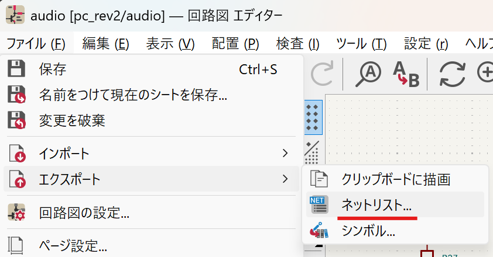
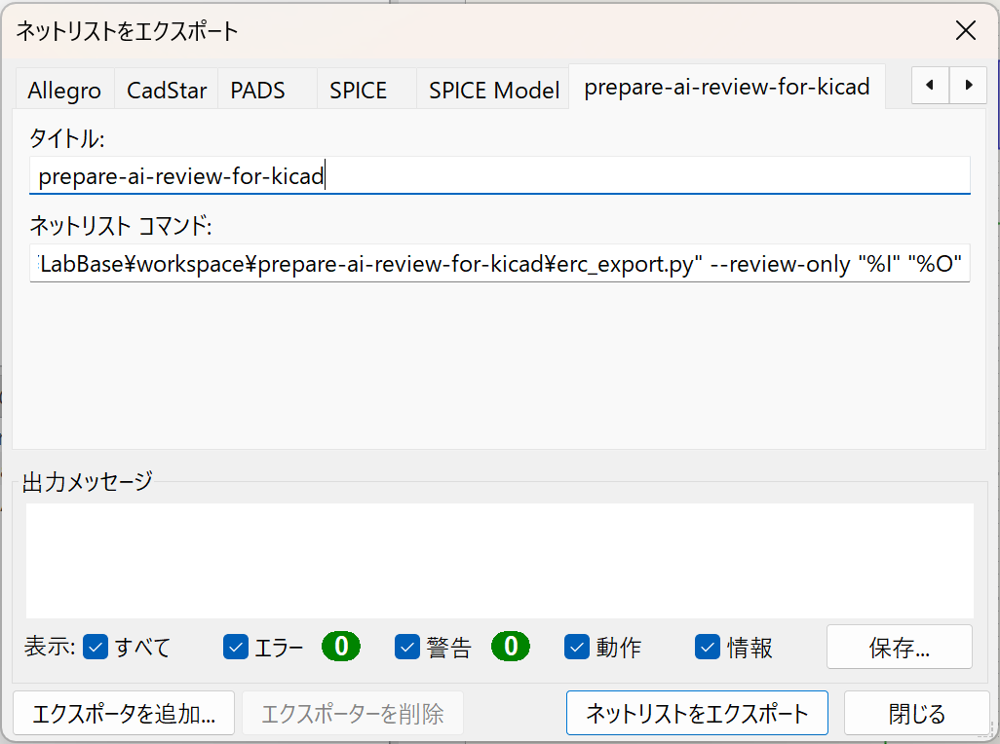
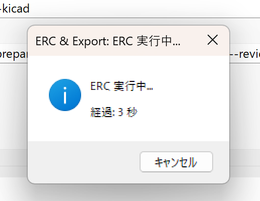
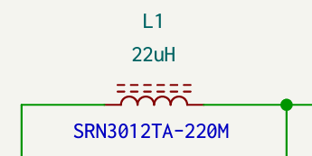
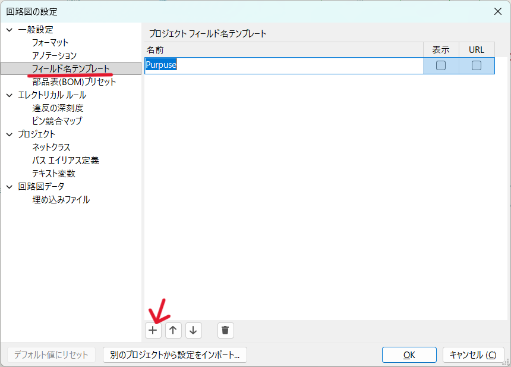

# prepare-ai-review-for-kicad

KiCad の回路図（.kicad_sch）を AI がレビューしやすい形式に変換します。

生の KiCad ファイルを直接 AI に読ませる場合に比べ、回路情報の解釈を大幅に高速化。
さらに、KiCad ファイル構造の誤読や部品属性の取りこぼしを減らし、回路レビューの品質と安定性を向上させます。

## 概要

Claude Code や Codex のような LLM での利用を想定しています。

LLM はテキスト処理が得意なため、回路図を画像ファイルとして渡すよりも
テキストとして回路情報を渡す方が効率よく、高精度に回路を読んでくれます。

KiCad の回路ファイル .kicad_sch はテキスト形式ではあるものの、配線の接続関係を把握するには座標情報の解釈が必要です。
LLM がこれを直接読む場合、回路レビューの前に KiCad のファイル構造からネット接続を復元する必要があり、時間がかかり誤読も起こり得ます。
そこで、あらかじめ接続関係をネットリスト形式へ変換して渡すことで、LLM を本来の回路レビューに集中させます。

KiCad 標準のネットリスト形式は回路のレビューには不必要な情報も含まれており、
LLM に読ませるには非効率なデータとなっています。
そこで、本ツールは KiCad 標準のネットリストを回路の機能的なレビューに特化した
形式へと変換することで、LLM による回路レビューを効率化・高品質化します。
また、変換時に AI を必要としないチェック（ERC + 機械的チェック）も行います。

出力された .review.txt ファイルを LLM に渡して回路のレビューをしてみてください。
LLM が回路情報そのものの理解と、問題点・改善点の検討に集中できるようになります。
レビューだけでなく、機能追加の相談などの出発点としての回路情報を AI に伝えるのにも役立ちます。

LLM に KiCad ファイルを解析させるのではなく、回路をレビューさせましょう！

## インストール

本ツールはカスタムネットリストエクスポータとして作ってありますので、
KiCad の回路図エディタ（eeschema）に組み込んで使います。

回路図エディタのメインメニューから
ファイル > エクスポート > ネットリスト
をクリックします。



「ネットリスクをエクスポート」ダイアログが開きます。



開いたダイアログで「エクスポータを追加」をクリックします。
すると新しいタブが増えますので、次の設定を行います。

- タイトル: `prepare-ai-review-for-kicad`
- ネットリスト コマンド: `"C:\Program Files\KiCad\10.0\bin\python.exe" "...\prepare-ai-review-for-kicad\erc_export.py" --review-only "%I" "%O"`
  - `KiCad\10.0` は実際に使っている KiCad のバージョンに合わせて変えてください。
  - 「...」は、本リポジトリ（prepare-ai-review-for-kicad）が置いてあるパスを書いてください。

Windows の場合の設定例を示しました。本ツールの動作検証は Windows 11 で行っていますが、他の OS でも動くかもしれません。動作報告やバグ報告をお待ちしております。

## 使い方

ダイアログの「ネットリストをエクスポート」ボタンをクリックします。
するとファイルの保存先を問い合わせるダイアログが出ますが、
ここでの設定は無視して KiCad のプロジェクトディレクトリにファイルを
出力する仕様になっていますので、全部そのまま「OK」をクリックします。
すると AI レビュー用ファイルの生成が始まります。

ERC 実行は比較的長い時間がかかるので、ERC 実行中はダイアログを出します。
ERC をする意味がないなと思ったらキャンセルして問題ありません。



ERC が完了（あるいはキャンセル）すると、KiCad のプロジェクトファイル
と同じディレクトリに ai-review ディレクトリが生成され、
その中に AI レビュー用ファイル .review.txt が作られます。

ファイル名は `プロジェクト名_タイムスタンプ.review.txt` となります。
タイムスタンプは「年月日時分秒」です。

このファイルをお好みの LLM に渡して、回路のレビューを依頼してください。

### 使い方説明動画

筆者が作っている KiCad プロジェクトに対して適用する例を
GIF 動画にしましたので参考にどうぞ。


## カスタムフィールドでレビュー精度を上げる

本ツールは KiCad のシンボルフィールドのうち、次のものを読み取って .review.txt に含めます。
未設定のフィールドは出力しません（AI に「空欄」を読ませても意味がないため）。

| フィールド | 種類 | 役割 | 記入例 |
| --- | --- | --- | --- |
| Value | 標準 | 設計上の値・型名 | `0.1uF` / `74HC04` |
| Footprint | 標準 | 物理的な実装 | `Diode_SMD:D_SOD-323` |
| Purpose | カスタム | この回路での用途 | `オシロスコープを当てるためのデバッグ端子` |
| Manufacturer | カスタム | 部品のメーカー名 | `Murata` |
| Manufacturer PN | カスタム | 部品のメーカー型番 | `GRM188R61A106ME69D` |

本ツールは回路図の「テキスト」機能で書かれたテキストを無視します。
テキスト機能ではなく、フィールドとして設定してください。
例えば下図は、テキストでインダクタ（コイル）の型番「SRN3012T-220M」を書き込んでいますが、これは無視されます。



なぜテキストを無視するかというと、そのテキストが何を表しているのか（型番？単なるメモ？）、どの部品に対するものなのか（もしかしたら特定の部品には属さない記述かも）を、機械的に判断するのが難しいからです。

ただし例外として、決まった見出しで始まるテキストは「設計メモ」として読み取ります（次節）。見出しを要求する理由は、まさに上に書いたことです。見出しがあれば「これは拾ってよい記述だ」と機械的に判断できます。

### カスタムフィールドの追加方法

カスタムフィールドは、部品単位、回路図単位、あるいは KiCad 全体の設定として追加できます。

1. 部品単位：回路図エディタで部品を選択して「プロパティ」を開き、「フィールドを追加」ボタン（「＋」マーク）で追加できます。
2. 回路図単位：回路図エディタ（eeschema）の「ファイル」>「回路図の設定」を開き、「フィールド名テンプレート」を開きます。
   
3. KiCad の全体設定：プロジェクトマネージャや回路図エディタの「設定」>「設定」を開き、「回路図エディター」>「フィールド名テンプレート」を開きます。

### なぜ精度が上がるのか

Purpose は設計意図を AI に伝えます。
たとえばピンヘッダ J2 に `オシロスコープを当てるためのデバッグ端子` と書いてあれば、AI はそれを常時接続される負荷として評価しません。
逆に空欄だと、AI は接続だけから意図を推測することになり、的外れな指摘や「要確認」が増えます。
意図が分かる部品では、AI は「意図どおりに実装されているか」という一段踏み込んだレビューができます。

Manufacturer / Manufacturer PN があると、AI はデータシートを参照して実際の定格を確認できます。
`100nF` だけでは耐圧・温度特性・許容差が分からないため、定格超過を見つけられません。型番があれば具体的な数値で検証できます。

### どの部品に書くと効果が大きいか

全部品に書く必要はありません。次のあたりを優先すると費用対効果が高いです。

- コネクタ・テストポイント: 外部の何がつながるのか、常時接続か一時的な接続かは、回路図からは読み取れません。Purpose を書く価値が高いです。
- 電源系の部品: 想定する電流・電圧や、フィルタ・保護の目的。
- 用途が読み取りにくい部品: 保護素子、ダンピング抵抗、オプション部品（実装しない部品）など。

## 設計メモを回路図に書く

回路全体にかかる前提や、部品単位の Purpose に書くには長くなる記述は、回路図にテキストで書いておくと .review.txt に含まれます。

- **Purpose**（部品のカスタムフィールド）: その部品 1 個の用途。
- **設計メモ**（回路図のテキスト）: 回路全体にかかる話、複数部品にまたがる話、Purpose に収まらない長さの話。

回路図エディタの「テキスト」または「テキストボックス」で、決まった見出しから書き始めます。

```
設計メモ
J1 RX/TXはFPGAの3.3V IOと接続
J1 VCCの想定範囲は4.5-5.5V
```

これが .review.txt の先頭のセクションとして、次のように出力されます。生成データ（ERC 結果や部品一覧）より前に置くのは、AI に設計の前提を読ませてから回路を読ませるためです。

```
== DESIGN NOTES ==
J1 RX/TXはFPGAの3.3V IOと接続
J1 VCCの想定範囲は4.5-5.5V
```

設計メモを書いた場合、必ず .kicad_sch ファイルを保存してからネットリストのエクスポートを行ってください。未保存の設計メモは読み取られません。

### 見出しの仕様

- 見出しは `Design Notes` / `設計メモ` / `設計ノート` のいずれかです。英語は大文字小文字を区別しません（`design notes` でも `DESIGN NOTES` でも構いません）。
- 見出しの直後は、**コロンか改行**である必要があります。コロンは半角 `:` でも全角 `：` でも構いません。
  - `設計メモ:` `設計メモ：` `Design Notes: 全体は3.3V系` のように、コロンに続けて同じ行に本文を書けます。
  - コロンを付けず、見出しだけの行で改行しても構いません（上の例）。
- 見出しより後ろの全文が本文になります。見出しそのものは出力しません（セクション名と重複するため）。
- `設計メモは別紙にある` のように、見出し語の直後がコロンでも改行でもない場合は、通常のテキストとして無視します。
- テキストは複数置けます。書かれている順に、空行区切りで並びます。
- 階層シートにも対応しています。親シート、子シートの順に集めます。

### 単体で読んで意味が通る文にする

見出しの無いテキストは読み取りません。回路図上のテキストは近くの部品に位置で紐づいていることが多く、位置の情報を落として並べると、どの部品の話なのか分からなくなるためです。

同じ理由で、設計メモは**それ単体で読んで意味が通る文**にしてください。「1uFでも可」ではなく「C3 は 1uF でも可」のように、部品名を含めて書きます。位置で伝わることは AI には伝わりません。

書いておくと効果が大きいのは、回路図の図面からは読み取れない類の情報です。

- 外部インターフェースの相手（何がつながるのか、その電圧・論理レベル）
- 電源の想定範囲や想定電流
- 意図的にそうしている設計判断（部品を実装しない、あえて定数を大きくした、など）
- 想定していない使い方（この端子は常時接続しない、など）

### 注意: 回路図を保存してからエクスポートする

設計メモはディスク上の .kicad_sch から読み取ります。中間ネットリストに回路図のテキストは含まれないためです。

一方でネットリストは KiCad のメモリ上の回路図から生成されるので、**保存していない編集は設計メモに反映されません**。メモを書いたら保存してからネットリストをエクスポートしてください。

拾えたメモの個数は実行ログに `design notes: 1 block(s)` として出ます。0 件のときは、見出しの書き方か保存を疑ってください。回路図ファイルを読めなかった場合は `warning: 回路図を読めません: <パス>` がログに出ます。

## テスト

リポジトリのルートディレクトリで、次のコマンドを実行します。

```
python3 -m unittest discover -v
```

標準ライブラリの `unittest` だけを使用しているため、追加のパッケージは不要です。
